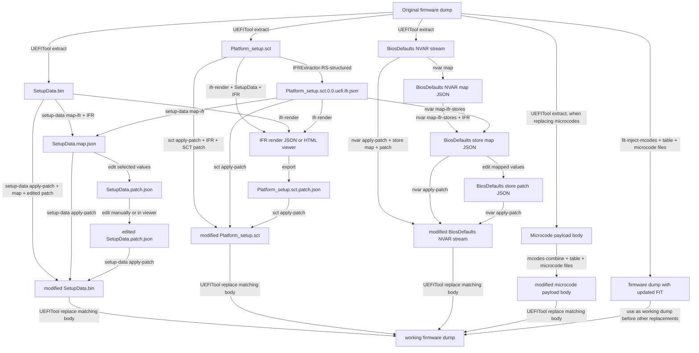

# UEFI Data and IFR Workflow

The `uefi` module covers Intel FIT and microcode data plus an IFR-driven workflow for `Platform_setup.sct` and AMI `SetupData`.

## Artifact Flow

The CLI does not unpack a firmware image or produce the IFR operation JSON. The only external steps are:

- **UEFITool**: extract the original body of each target object and replace that same object body in a copy of the dump.
- **IFRExtractor-RS-structured**: create `Platform_setup.sct.0.0.uefi.ifr.json` from the exact extracted `Platform_setup.sct`.

Every artifact in a run must originate from one firmware dump. Keep the original dump immutable and apply replacements to a working copy.



`nvar map` and `nvar map-ifr-stores` do not extract an NVAR stream from a firmware dump or write data back to firmware. `nvar apply-patch` writes a modified NVAR stream; replace the exact extracted NVAR object body with UEFITool to use it in a firmware dump.

`nvar map` version 2 stores each complete NVAR payload in `variables[].value` as Base64. `nvar map-ifr-stores` version 2 takes the question-sized slice from that payload and writes a patchable mapping `id` plus a readable `value`. Numeric and OneOf values are decimal, CheckBox values are `true` or `false`, String and Password values are UTF-16LE text, and unsupported value types are uppercase hexadecimal bytes.

The map filename is user-selected and is not part of its format. For example, use `AF516361-BiosDefaults-to-nvar-map.json` rather than embedding the source IFR filename such as `Platform` or `SocketSetup` in the filename.

Create a patch document with the mapped question IDs and their new values:

```json
{
  "version": 1,
  "type": "BiosDefaults-Store-Patch",
  "varPatches": [
    {
      "id": "0001-Setup-0012-000004FA",
      "value": "12"
    }
  ]
}
```

Apply it to the exact NVAR stream used to create the store map:

```bash
uefi-mod-tools uefi nvar apply-patch \
  --input AF516361-BiosDefaults.bin \
  --map AF516361-BiosDefaults-to-nvar-map.json \
  --patch AF516361-BiosDefaults-to-nvar-patch.json \
  --output modified-AF516361-BiosDefaults.bin
```

Use `--ignore-versions` only when an older or newer map/patch JSON is known to retain the compatible schema. It does not ignore document type mismatches.

### Reintegration Order

1. Use `UEFITool` to extract `Platform_setup.sct`, `SetupData`, and, if needed, the BIOS defaults NVAR stream and microcode payload from one original dump.
2. Run IFRExtractor-RS-structured on the extracted SCT. Do not reuse its IFR JSON with an SCT from a different dump.
3. Create and apply the SetupData and SCT patches to their extracted bodies.
4. For microcodes, first run `mcodes-combine` on the extracted payload body, replace that body in a working dump with UEFITool, then run `fit-inject-mcodes` on that working dump. `fit-inject-mcodes` updates FIT entries only; it does not write microcode payload bytes.
5. Replace the modified SCT and SetupData bodies in the same working dump. Each replacement must target the exact object from which the original body was extracted.
6. Validate the final dump with the usual platform-specific checks before flashing. A successful command only validates its local transformation, not that the final firmware will boot.

## FIT

### Read and Write

```bash
uefi-mod-tools uefi fit-read --input fit.bin --output fit.json
uefi-mod-tools uefi fit-write --input fit.json --output modified-fit.bin
```

`fit-read` emits the JSON accepted by `fit-write`. Verification is enabled by default and requires a byte-identical repack. Preserve `headGarbage` and `tailGarbage` unless intentionally changing data outside the FIT structure.

The first entry must be `FitHeaderEntry`; its `size` equals the number of FIT entries. Addresses, sizes, versions, and checksums accept hexadecimal strings.

```json
{
  "headGarbage": "",
  "entries": [
    {
      "address": "0x00000000FFFFFFC0",
      "size": "0x00000001",
      "reserved": 0,
      "version": "0x00000100",
      "checksumValidate": true,
      "type": "FitHeaderEntry",
      "checksum": 0
    }
  ],
  "tailGarbage": ""
}
```

### Microcode Injection

```bash
uefi-mod-tools uefi mcodes-combine \
  --input bios.bin --table microcodes.json --mcodes microcodes --output modified-bios.bin

uefi-mod-tools uefi fit-inject-mcodes \
  --input fit.bin --table microcodes.json --mcodes microcodes --output modified-fit.bin
```

Both commands use the same table:

```json
{
  "sectionBaseAddress": "0xFFB00090",
  "usableStart": "0x00000000",
  "usableEnd": "0x00100000",
  "microcodeFiles": ["cpu-000906EA.bin", "cpu-000906EB.bin"]
}
```

Microcode files are resolved relative to `--mcodes`. `sectionBaseAddress` is added to calculated microcode addresses. The usable range is `[usableStart, usableEnd)`; omit `usableEnd` or use `-1` to allow the rest of the input.

## IFR, SetupData, and SCT

This workflow requires three matching inputs:

- an IFR operation JSON dump;
- `Platform_setup.sct`;
- `SetupData` binary.

The tool does not produce the IFR dump itself. Use an IFR extractor compatible with the target firmware, then keep that dump with the SCT and SetupData source used to create it.

### Extract and Patch SetupData

```bash
uefi-mod-tools uefi setup-data map-ifr \
  --input SetupData.bin --ifr Platform_setup.ifr.json --output SetupData.map.json

uefi-mod-tools uefi setup-data apply-patch \
  --input SetupData.bin --map SetupData.map.json --patch SetupData.patch.json --output modified-SetupData.bin
```

Mapping writes an `AMI-SetupData-IFR-Map` document containing matching AMI SetupData questions and SHA-256 hashes of the source SetupData and IFR files. The `AMI-SetupData-Patch` document identifies questions by `id` and may set `accessLevel`, `failsafe`, and `optimal` independently. The patch command verifies the map and source hashes before modifying the SetupData binary. Use `--ignore-versions` only for a schema-compatible map or patch with a newer version; it cannot ignore a different document type. Use a different output filename to preserve the original.

The supported editable metadata is `accessLevel`, `failsafe`, and `optimal`. Access-level meaning is platform-dependent; a commonly used modding value is `0x05`, but it is not a universal AMI role or a guarantee that a setup item becomes usable.

### Patch Supported SCT Suppressions

```bash
uefi-mod-tools uefi sct apply-patch \
  --input Platform_setup.sct \
  --ifr Platform_setup.ifr.json \
  --patch Platform_setup.sct.patch.json \
  --output modified-Platform_setup.sct
```

The patch document names original IFR offsets and only supports disabling patchable non-empty `SuppressIf` scopes:

```json
{
  "version": 1,
  "type": "AMI-IFR-SCT-Patch",
  "suppressIfPatches": [
    {
      "disable": true,
      "offset": 88706
    }
  ]
}
```

The command accepts IFR extractor version `1.6.1` and SCT patch version `1`; use `--ignore-versions` only for a schema-compatible newer version. It cannot ignore another patch type or IFR extraction mode. Conditions can guard a value question, a `Ref` navigation item, or an entire nested scope. Removing a suppression does not bypass checks elsewhere in the firmware.

## IFR Render and Viewer

```bash
uefi-mod-tools uefi ifr-render \
  --input Platform_setup.sct \
  --setup-data SetupData.bin \
  --ifr Platform_setup.ifr.json \
  --format json \
  --output Platform_setup.ifr-render.json
```

`--format json` emits a structured document containing formsets, forms, VarStores, questions, conditions, defaults, IFR source locations, and matched SetupData metadata.

`--format html` embeds the same document in a self-contained React/MUI viewer:

```bash
uefi-mod-tools uefi ifr-render \
  --input Platform_setup.sct \
  --setup-data SetupData.bin \
  --ifr Platform_setup.ifr.json \
  --format html \
  --output ifr-viewer.html
```

The viewer provides:

- searchable IFR tree with FormSet, Form, question, and condition nodes;
- readable condition expressions with QuestionId navigation;
- `Ref` to Form links and reverse form references;
- SetupData/SCT patch editing, import/export, and a Changes review tab;
- logical VarStore offsets and ranges from render JSON, not a physical NVRAM map;
- dark and light themes plus raw JSON inspection;
- directory workspaces when browser capabilities allow it.

The selected theme is stored in browser-local UI preferences. Firmware inputs, loaded workspaces, and patches are not persisted by the viewer.

`ascii-tree` is accepted as a format but is currently unimplemented and exits with status 1 without writing output.

### Serve Locally

```bash
uefi-mod-tools uefi ifr-render \
  --input Platform_setup.sct \
  --setup-data SetupData.bin \
  --ifr Platform_setup.ifr.json \
  --format html \
  --serve 127.0.0.1:4060
```

`--serve` requires `--format html`, binds only to `localhost` or a loopback IP, serves the generated page at `/`, and runs until Ctrl+C. It replaces file output for that invocation.

Opening the viewer from `http://127.0.0.1` allows Chromium's File System Access API, so Save all can write a complete workspace to a selected directory. `file://` and browsers without that API use directory-input and download fallbacks.

### Workspace Files

For an embedded render document, Save all writes patch-only workspace files:

```text
ifr-editor.json
SetupData.patch.json
<name>.sct.patch.json
```

Its manifest names both patch files and deliberately omits `IfrRenderFile`:

```json
{
  "Version": 1,
  "SetupDataPatchFile": "SetupData.patch.json",
  "SctPatchFile": "Platform_setup.sct.patch.json"
}
```

Load directory applies this patch-only workspace to the render document embedded in the HTML viewer.

When the render document was loaded from a directory or through `Load IFR render JSON`, Save all also writes `<name>.ifr-render.json` and adds its name to the manifest:

```json
{
  "Version": 1,
  "SetupDataPatchFile": "SetupData.patch.json",
  "SctPatchFile": "Platform_setup.sct.patch.json",
  "IfrRenderFile": "Platform_setup.ifr-render.json"
}
```

Loading a manifest with `IfrRenderFile` replaces the embedded document before applying patches. Without `ifr-editor.json`, Load directory discovers unambiguous conventional filenames. If multiple candidate render or SCT patch files exist, add the manifest instead of relying on an arbitrary selection.

The browser never patches SCT or SetupData binaries. Export or save patch JSON, then use `setup-data apply-patch` and `sct apply-patch` to produce binary outputs.
